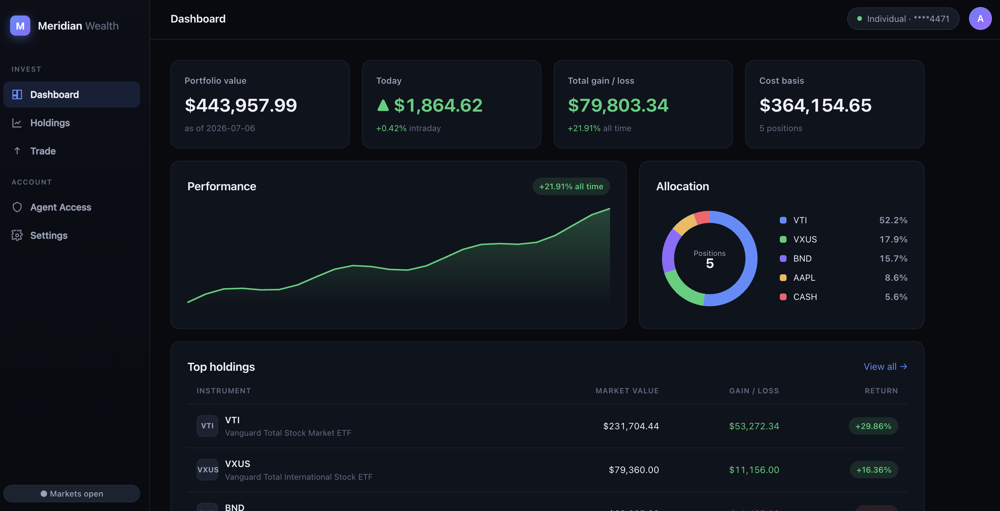
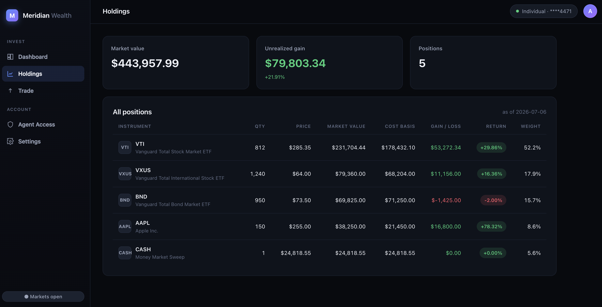
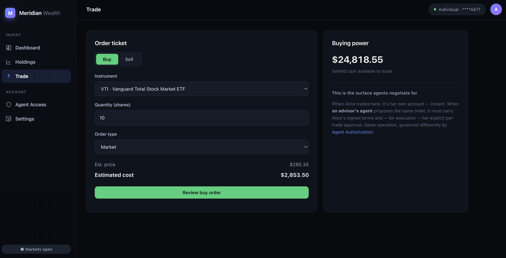
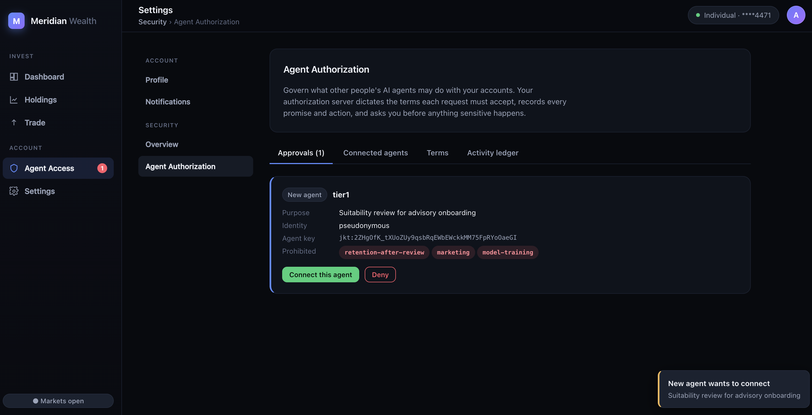
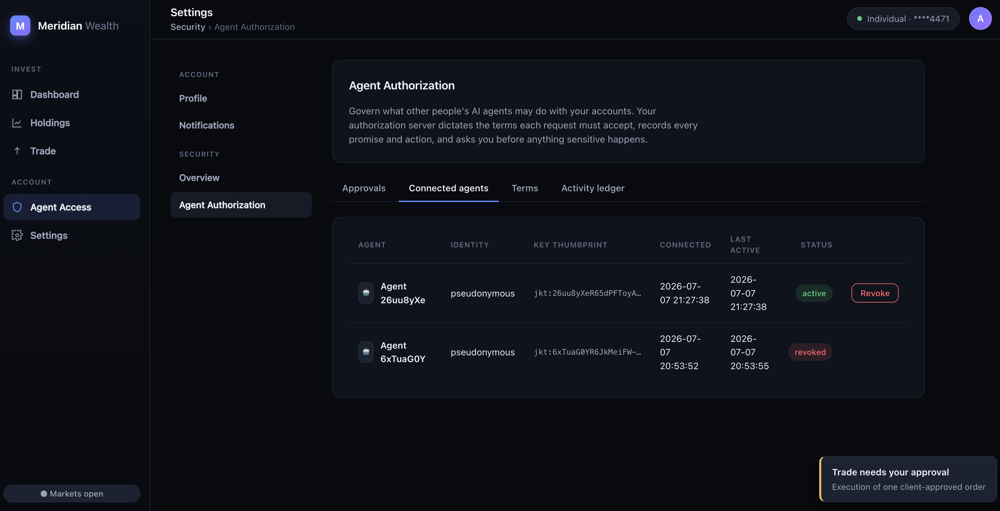
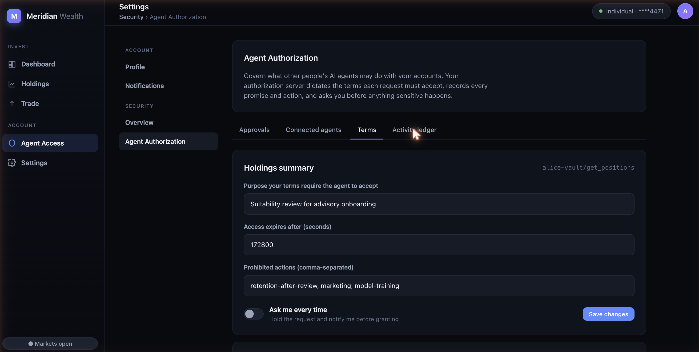
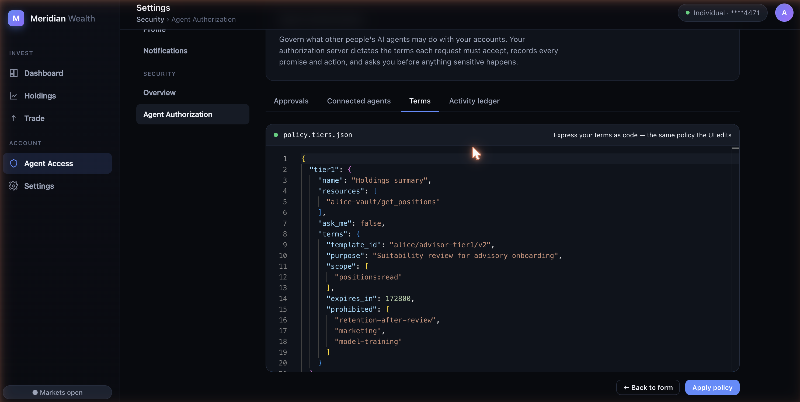
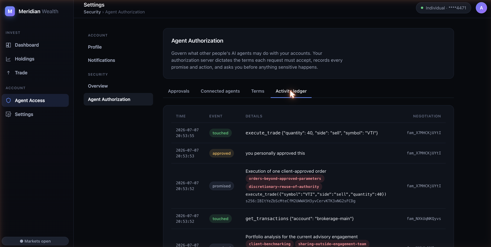
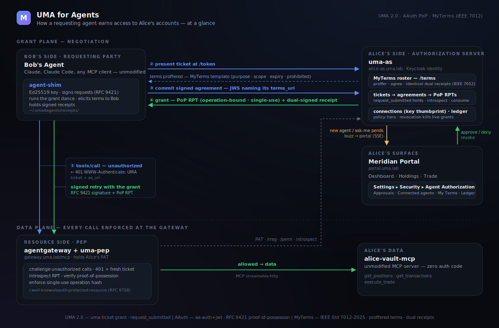

# UMA for Agents

A working proof-of-concept that carries [User-Managed Access (UMA)
2.0](https://docs.kantarainitiative.org/uma/wg/rec-oauth-uma-grant-2.0.html)
into the agent era: the owner sets policy once, and other people's AI agents
negotiate access to her resources against it — while she's offline for the easy
cases, and with a tap for the sensitive ones.

The whole stack runs locally with one command. It binds to
[AAuth](https://github.com/dickhardt/AAuth) for agent identity and
proof-of-possession.

> **The question.** Every agent protocol today answers *"is this my agent doing
> my task?"* None answers *"may your agent touch my stuff?"* An agent economy is
> agents touching other people's stuff — and the owner isn't in the loop when
> the agent shows up. UMA answered that a decade ago; this shows what it looks
> like with agent-shaped mechanics.

See **[FINDINGS.md](FINDINGS.md)** for the recommendations to spec authors,
**[docs/ARCHITECTURE.md](docs/ARCHITECTURE.md)** for the system design, and
**[docs/PROTOCOL.md](docs/PROTOCOL.md)** for the wire contract.

## The demo

Alice is a brokerage client at *Meridian Wealth*. Bob is her new financial
advisor, and his firm runs an agent. Over one day:

0. **Enrollment** — Bob's agent registers with his AAuth person/agent server
   and receives a verifiable agent token; Alice's authorization server checks
   it against the issuer's published keys before believing a word of it.
1. **Holdings summary** — Bob's agent asks; because Alice has connected it and
   her terms permit it, the grant is automatic, purpose-bound, and expiring.
2. **Transaction history** — granted too, under visibly stricter terms her
   authorization server dictates.
3. **A trade** — Alice's policy says *ask me*. The request pends, her portal
   buzzes, she approves the specific order from the couch, and the agent
   receives a single-use grant good for exactly that trade.

At any point Alice opens her portal and sees which agents are connected, what
each promised, what it touched, and the one action she personally approved —
and can revoke any of them.

## Screenshots

### Alice's Brokerage 



*A brokerage portal, with MCP, holding Alice's portfolio — which she would like to give her financial advisor's agent access to*

### New Agent Requests to Connect to Alice's Brokerage 

*An agent with **no standing connection** pends on first contact regardless of tier*

### Manage Agent Access & Revocation

*(Connected Agents → Revoke) deactivates the connection and any live RPTs immediately.*

### Edit RO Policy Terms as Forms or as Code


*Express the resource owner policy terms that agents agree to in a form or as code*

### Activity Ledger

*Track all agent activity live in the ledger*

## Quick start

Prerequisites: Docker Desktop (or Engine + Compose v2) and
[mkcert](https://github.com/FiloSottile/mkcert) (`brew install mkcert`).

```bash
make init        # local CA, TLS certs, signing keys, DNS for *.uma.lab
make up          # the whole stack
make smoke-test  # verify every service, including the live grant challenge
```

Then either watch it run headlessly, or drive it with your own agent:

```bash
make demo-all SIM=1   # walk all three acts; SIM approves Alice's taps for you
make audit            # print the promised / touched / approved ledger
```

Open **https://portal.uma.lab** to sign in as Alice (`alice` / `alice-demo`),
watch approvals arrive live, edit her terms, and manage connected agents.
Observability is at **https://grafana.uma.lab**.

`make init` offers to configure `/etc/resolver/uma.lab` (sudo) and you can run
`make trust-ca` so your browser trusts the local certificates.

## Connect your own agent

Bob's agent can be an unmodified MCP client. A small local shim handles agent
identity, request signing, and the grant negotiation — surfacing Alice's terms
for you to approve. See [clients/agent-shim/README.md](clients/agent-shim/README.md).

## Architecture at a glance



## How it works, briefly

Before anything else, the agent can read the resource's published metadata
(RFC 9728): who the authorization server is and what tool surfaces exist —
though never *whose* they are; that lives behind a protected listing only
Alice's authorization server may query. An agent then calls a tool through
the gateway and is challenged with a permission ticket (the challenge names
the metadata, and the agent checks the two against each other). It presents
the ticket to Alice's authorization server, which dictates the terms it
requires; the agent signs those terms as an intent contract and commits. For a known agent under a permissive tier the grant is immediate; for
a new agent or a sensitive action the request pends until Alice approves in her
portal. The grant is a proof-of-possession token scoped to exactly what was
agreed. Full detail in [docs/ARCHITECTURE.md](docs/ARCHITECTURE.md).

## Make targets

| Target | Purpose |
|---|---|
| `make init` | Local CA, TLS certs, signing keys, DNS |
| `make up` / `make down` | Start / tear down the stack |
| `make smoke-test` | Verify every service end to end |
| `make demo-tier1/2/3`, `make demo-all` | Walk the demo acts (add `SIM=1` to auto-approve) |
| `make audit` | Print Alice's activity ledger |
| `make reset` | Rewind demo state |
| `make trust-ca` | Trust the local CA in your system store |

## Demo credentials — not secrets

This is a self-contained local lab, so it ships with fixed development
credentials in `docker-compose.yml` and the Keycloak realm. **They are demo
defaults, not secrets** — do not reuse them anywhere real, and do not deploy
this stack as-is on a public network.

| What | Value | Where |
|---|---|---|
| Alice's login | `alice` / `alice-demo` | `keycloak/alice-realm.json` |
| Keycloak admin | `admin` / `uma4agents-admin` | `KC_ADMIN_PASSWORD` |
| Gateway's OAuth client secret (exchanged for its PAT) | `gateway-dev-secret` | `UMA_AS_RS_CLIENT_SECRET` |
| Portal session secret | `dev-session-secret` | `PORTAL_SESSION_SECRET` |
| Person-server admin token | `uma4agents-ps-admin` | `PS_ADMIN_TOKEN` |
| uma-as OIDC client secret | `uma-as-demo-secret` | `keycloak/alice-realm.json` |

Every value in the table's right column except the two in the realm file can be
overridden via a `.env` file (see `.env.example`); the realm values live in
`keycloak/alice-realm.json`. The tokens that actually flow — Alice's owner
token, the gateway's PAT, the agent's `aa-agent+jwt` — are all issued at
runtime (OIDC login, `client_credentials`, and AAuth enrollment
respectively); none of them are configured strings.

## Troubleshooting

| Issue | Fix |
|---|---|
| `mkcert: command not found` | `brew install mkcert` (macOS) |
| Browser can't resolve `*.uma.lab` | `make dns-setup`, then restart the browser |
| TLS warnings in the browser | `make trust-ca` |
| A config edit isn't picked up | `docker compose up -d --force-recreate <svc>` (single-file mounts go stale on inode swap) |

## License & attribution

A collaboration exploring UMA's fit for agentic authorization. AAuth components
are built from their upstream reference implementations. Brokerage figures are
fixture data flowing through a real protocol path — no market data or real
orders.
