# UMA for Agents

[](https://u4a.ai)
[](LICENSE)
[](https://docs.kantarainitiative.org/uma/wg/rec-oauth-uma-grant-2.0.html)
[](https://github.com/dickhardt/AAuth)
[](docs/MCP-BINDING.md)
[](docs/KUBERNETES.md)

[](https://u4a.ai)

A working proof-of-concept that carries [User-Managed Access (UMA)
2.0](https://docs.kantarainitiative.org/uma/wg/rec-oauth-uma-grant-2.0.html)
into the agent era: the owner sets policy once, and other people's AI agents
negotiate access to her resources against it — while she's offline for the easy
cases, and with a tap for the sensitive ones.

The whole stack runs locally with one command. It binds to
[AAuth](https://github.com/dickhardt/AAuth) for agent identity and
proof-of-possession.

> **The question.** Agent-identity protocols answer *"is this my agent doing my
> task?"* The harder question — *"may your agent touch my stuff?"* — needs an
> authority on the owner's side and a negotiation to fill it. AAuth's four-party
> mode puts that authority in the right place; what stays unspecified is how an
> *offline* owner actually answers. UMA worked that out a decade ago. This binds
> the two, and shows what it looks like with agent-shaped mechanics.

The animation above is the short version; **[u4a.ai](https://u4a.ai)** is the
whole story, with narration and a scrubber.

See **[FINDINGS.md](FINDINGS.md)** for the recommendations to spec authors,
**[docs/ARCHITECTURE.md](docs/ARCHITECTURE.md)** for the system design,
**[docs/KUBERNETES.md](docs/KUBERNETES.md)** for the reference architecture and
a fifteen-minute demo guide,
**[docs/PROTOCOL.md](docs/PROTOCOL.md)** for the wire contract, and
**[docs/MCP-BINDING.md](docs/MCP-BINDING.md)** for how the grant rides MCP
2026-07-28 (plus the extension it proposes,
[ext-auth-third-party-authorization.md](docs/ext-auth-third-party-authorization.md)).

**[docs/FLOW.md](docs/FLOW.md)** is the one to read if you only read one: the
owner never has to know how the asking agent is identified, checked against
four different identity regimes with `make flow-check`.
**[docs/KWAAI-BINDING.md](docs/KWAAI-BINDING.md)** puts her side inside a
personal AI, and **[docs/FIXTURE.md](docs/FIXTURE.md)** is the minimal
fixture the protocol is tested on with nothing underneath it.

## Try it, without installing anything

[](https://codespaces.new/nickgamb/uma4agents?devcontainer_path=.devcontainer%2Fdevcontainer.json)

[](screenshots/codespace-demo.mp4)

*Two and a half minutes, start to finish — click through for the video.*

That opens the **Kubernetes reference architecture** in a browser — the whole
toolchain present, `*.uma.lab` already resolving, and the walkthrough open
beside a terminal. Thirteen minutes to a running three-node cluster, then:

```bash
make k8s-smoke-test   # 13 checks
make k8s-demo-all     # Alice's whole day
make codespaces-web   # her portal, in a browser tab
```

Measured numbers and what to notice at each step are in
[docs/KUBERNETES.md](docs/KUBERNETES.md). Prefer to run it on your own
machine? [Quick start](#quick-start) below.

## The demo

Alice is a brokerage client at *Meridian Wealth*. Bob is her new financial
advisor, and his firm runs an agent. Over one day:

0. **Enrollment** — Bob's agent registers with his AAuth person/agent server
   and receives a verifiable agent token; Alice's authorization server checks
   it against the issuer's published keys before believing a word of it.
1. **Holdings summary** — Bob's agent asks; because Alice has connected it and
   her terms permit it, the grant is automatic, purpose-bound, and expiring.
2. **Transaction history** — granted too, under visibly stricter terms her
   authorization server dictates.
3. **A trade** — Alice's policy says *ask me*. The request pends, her portal
   buzzes, she approves the specific order from the couch, and the agent
   receives a single-use grant good for exactly that trade.

At any point Alice opens her portal and sees which agents are connected, what
each promised, what it touched, and the one action she personally approved —
and can revoke any of them.

## Screenshots

### Alice's Brokerage 
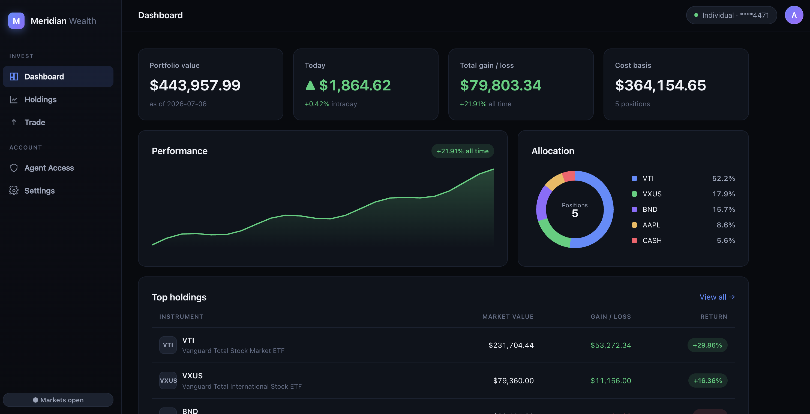
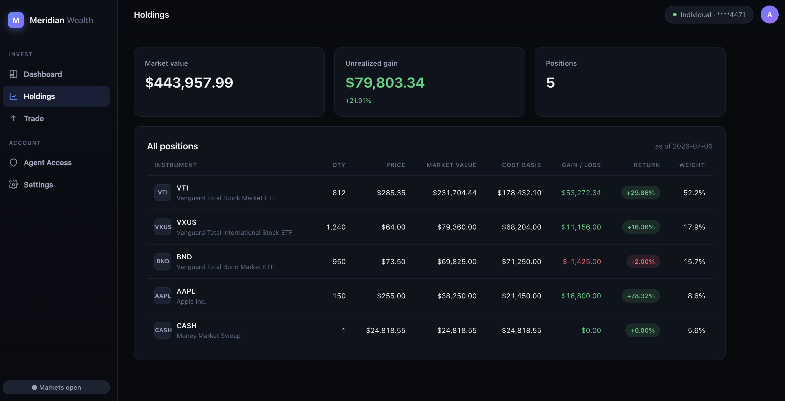
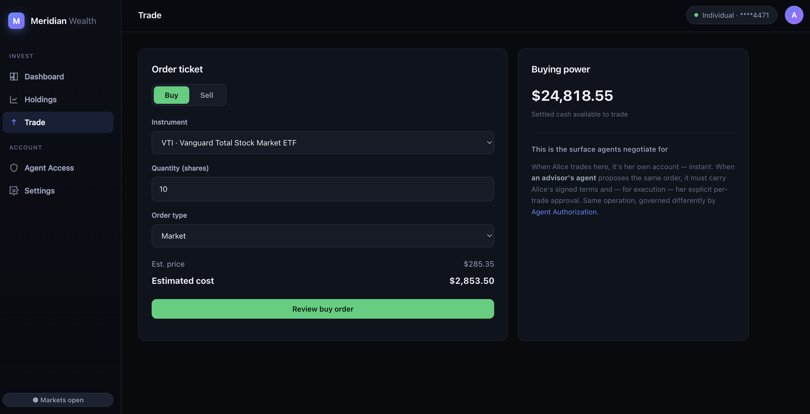
*A brokerage portal, with MCP, holding Alice's portfolio — which she would like to give her financial advisor's agent access to*

### New Agent Requests to Connect to Alice's Brokerage 
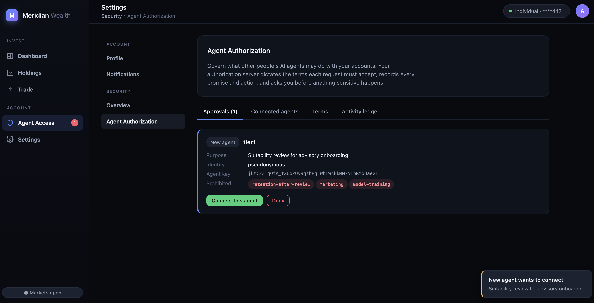
*An agent with **no standing connection** pends on first contact regardless of tier*

### A Sensitive Operation Pends for Alice — One Approval, One Trade
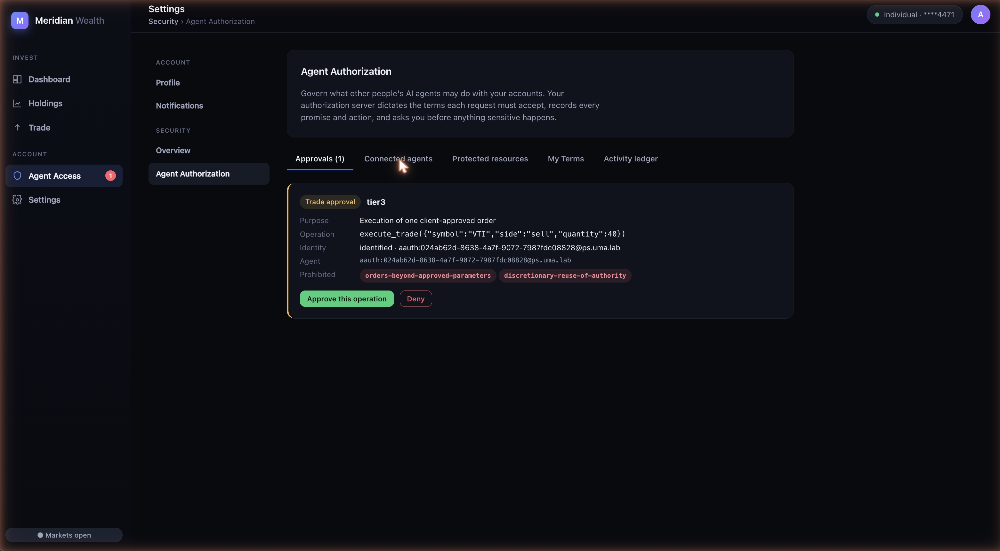
*An ask-me tier holds the request until Alice taps. The agent is **identified** — its `aauth:…@ps.uma.lab` identity was verified against its issuer's published keys, not claimed — and her approval releases a single-use grant bound to exactly this order.*

### Manage Agent Access & Revocation
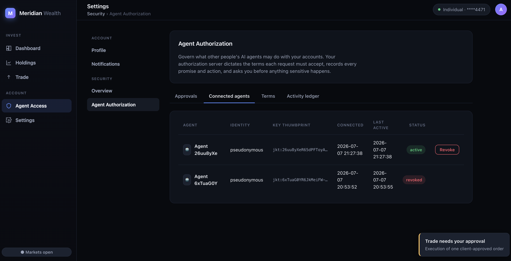
*(Connected Agents → Revoke) deactivates the connection and any live RPTs immediately.*

### Discovery, Split Into Public and Protected (RFC 9728)
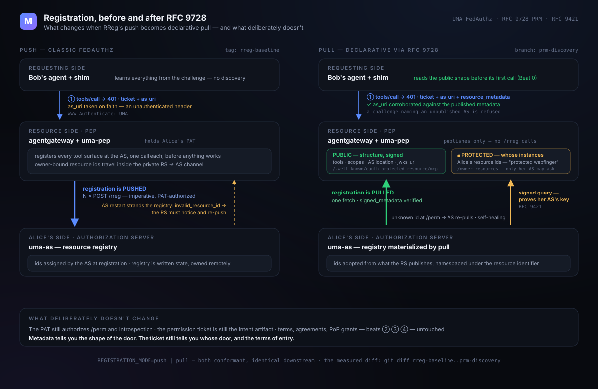
*Registration flips from pushed to pulled; the challenge gains a second witness; the ticket keeps its job*

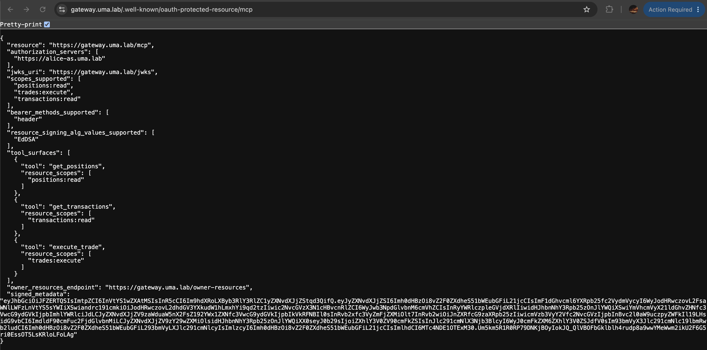
*The resource's public metadata is **structural**: tool surfaces and scopes, the owner's authorization server, `jwks_uri`, `signed_metadata` — and a pointer to the protected owner-resources endpoint. Whose resources these are is deliberately not here.*

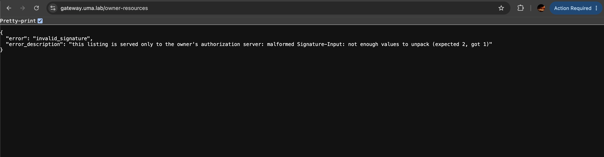
*The owner-resources listing refuses anyone who can't prove they're the owner's authorization server — "a kind of protected webfinger for Alice's stuff"*

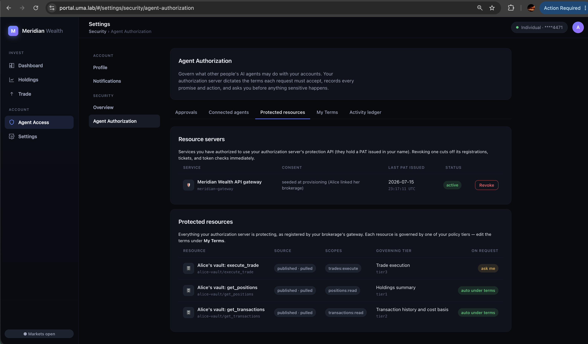
*Alice's view of both standing relationships: the gateway holding a PAT issued in her name (revocable), and every protected resource her AS **pulled** from the gateway's published metadata (`Source: published · pulled`)*

### Edit RO Policy Terms as Forms or as Code
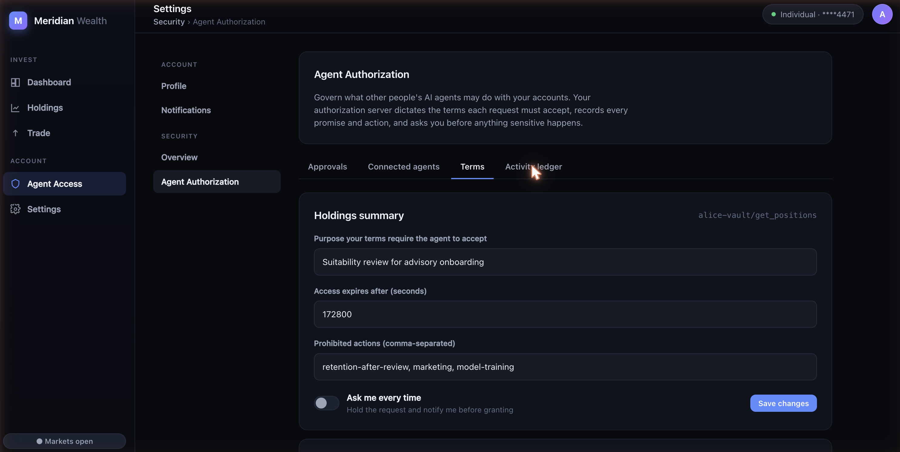
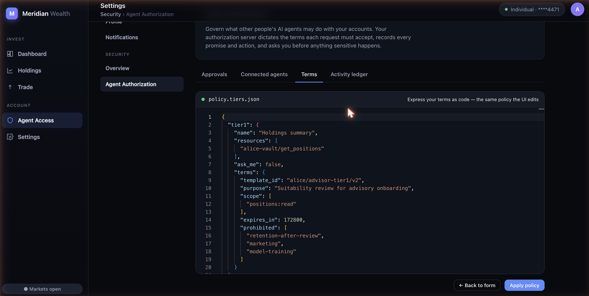
*Express the resource owner policy terms that agents agree to in a form or as code*

### Activity Ledger
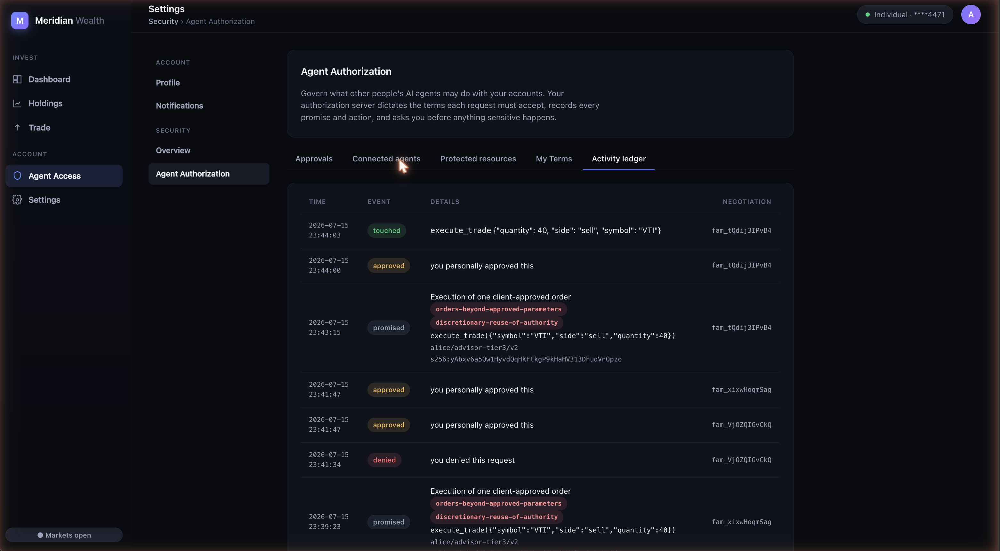
*The full trail of one afternoon: what the agent **promised** (the signed terms, hash and all), what Alice **personally approved** (and denied), and what was actually **touched** — every row correlated by its negotiation id*

## Quick start

This is the compose stack, on your own machine — ninety seconds, no cluster.
For the Kubernetes path with nothing to install, see
[Try it](#try-it-without-installing-anything) above.

Prerequisites: Docker Desktop (or Engine + Compose v2) and
[mkcert](https://github.com/FiloSottile/mkcert) (`brew install mkcert`).

```bash
make init        # local CA, TLS certs, signing keys, DNS for *.uma.lab
make up          # the whole stack
make smoke-test  # verify every service, including the live grant challenge
```

Then either watch it run headlessly, or drive it with your own agent:

```bash
make demo-all SIM=1   # walk all three acts; SIM approves Alice's taps for you
make audit            # print the promised / touched / approved ledger
```

Open **https://portal.uma.lab** to sign in as Alice (`alice` / `alice-demo`),
watch approvals arrive live, edit her terms, and manage connected agents.
Observability is at **https://grafana.uma.lab**.

`make init` offers to configure `/etc/resolver/uma.lab` (sudo) and you can run
`make trust-ca` so your browser trusts the local certificates.

## Connect your own agent

Bob's agent can be an unmodified MCP client, and so can yours, and so can any
number of others. A small local shim handles agent identity, request signing
and the grant negotiation — it is a plain stdio MCP server, so any client that
launches MCP servers can launch it.

A pseudonymous agent **is** its key: the connection handle is its thumbprint.
Give each agent its own keystore and each is a distinct party, with its own
first-contact approval, its own signed terms, its own ledger trail and its own
revocation.

What makes that scale is that Alice never configures them one by one. Her
tiers are written against *resources* — which tools, what terms, whether she
must tap — and name no agent at all. An agent she has never seen is not a hole
in her policy; it is just the next one to negotiate against terms that already
exist.

See [clients/agent-shim/README.md](clients/agent-shim/README.md).

## Architecture at a glance


Deployed at scale, each party becomes its own namespace and the seam between
them is enforced by a service mesh rather than described in a document —
`make kind-up`, then [docs/KUBERNETES.md](docs/KUBERNETES.md) for the
fifteen-minute walkthrough.


## How it works, briefly

Before anything else, the agent can read the resource's published metadata
(RFC 9728): who the authorization server is and what tool surfaces exist —
though never *whose* they are; that lives behind a protected listing only
Alice's authorization server may query. An agent then calls a tool through
the gateway and is challenged with a permission ticket (the challenge names
the metadata, and the agent checks the two against each other). It presents
the ticket to Alice's authorization server, which dictates the terms it
requires; the agent signs those terms as an intent contract and commits. For a known agent under a permissive tier the grant is immediate; for
a new agent or a sensitive action the request pends until Alice approves in her
portal. The grant is a proof-of-possession token scoped to exactly what was
agreed. Full detail in [docs/ARCHITECTURE.md](docs/ARCHITECTURE.md).

## Make targets

| Target | Purpose |
|---|---|
| `make init` | Local CA, TLS certs, signing keys, DNS |
| `make up` / `make down` | Start / tear down the stack |
| `make smoke-test` | Verify every service end to end |
| `make demo-tier1/2/3`, `make demo-all` | Walk the demo acts (add `SIM=1` to auto-approve) |
| `make audit` | Print Alice's activity ledger |
| `make shim-test` | Drive the shim under a scripted MCP client (both approval paths, and the pend) |
| `make embedded-check` | Run the whole grant with the resource enforcing itself — no gateway in the path |
| `make intent-check` | Whose intent the grant carries: her terms, the agent's stated errand, the record that names it |
| `make sig-test` | Unit-test the RFC 9421 profile |
| `make store-test` | Race 32 callers at each single-use artifact, on both storage backends |
| `make kind-up` / `make kind-down` | The whole Kubernetes lab, from nothing / delete it |
| `make k8s-smoke-test`, `k8s-policy-test` | Verify the deployed lab; prove the trust boundary denies |
| `make k8s-demo-all`, `k8s-load`, `k8s-chaos` | Walk Alice's day; 24 agents at once; break it mid-grant |
| `make reset` | Rewind demo state |
| `make trust-ca` | Trust the local CA in your system store |

The authorization server keeps its grant state in memory by default, which is
what this stack runs and what `make reset` rewinds. `UMA_AS_STORE=postgres`
selects a backend that is correct across replicas; both pass the same
concurrency suite, because "single-use" has to mean indivisible and not merely
once (see rec 9 in [FINDINGS.md](FINDINGS.md)).

## Demo credentials — not secrets

This is a self-contained local lab, so it ships with fixed development
credentials in `docker-compose.yml` and the Keycloak realm. **They are demo
defaults, not secrets** — do not reuse them anywhere real, and do not deploy
this stack as-is on a public network.

| What | Value | Where |
|---|---|---|
| Alice's login | `alice` / `alice-demo` | `keycloak/alice-realm.json` |
| Keycloak admin | `admin` / `uma4agents-admin` | `KC_ADMIN_PASSWORD` |
| Gateway's OAuth client secret (exchanged for its PAT) | `gateway-dev-secret` | `UMA_AS_RS_CLIENT_SECRET` |
| Portal session secret | `dev-session-secret` | `PORTAL_SESSION_SECRET` |
| Person-server admin token | `uma4agents-ps-admin` | `PS_ADMIN_TOKEN` |
| uma-as OIDC client secret | `uma-as-demo-secret` | `keycloak/alice-realm.json` |

Every value in the table's right column except the two in the realm file can be
overridden via a `.env` file (see `.env.example`); the realm values live in
`keycloak/alice-realm.json`. The tokens that actually flow — Alice's owner
token, the gateway's PAT, the agent's `aa-agent+jwt` — are all issued at
runtime (OIDC login, `client_credentials`, and AAuth enrollment
respectively); none of them are configured strings.

## Troubleshooting

| Issue | Fix |
|---|---|
| `mkcert: command not found` | `brew install mkcert` (macOS) |
| Browser can't resolve `*.uma.lab` | `make dns-setup`, then restart the browser |
| TLS warnings in the browser | `make trust-ca` |
| A config edit isn't picked up | `docker compose up -d --force-recreate <svc>` (single-file mounts go stale on inode swap) |

## License & attribution

Licensed under the [Apache License 2.0](LICENSE). A collaboration exploring
UMA's fit for agentic authorization, with Eve Maler.

[NOTICE](NOTICE) carries the full attribution list: the specifications this
profiles (UMA 2.0, RFC 9728, RFC 9421, AAuth, IEEE 7012), and the third-party
components the lab uses. Nothing third-party is vendored here — `make` and
`docker compose` fetch each piece from its own origin, under its own license.

Two things worth reading there before you build on this:

- The **AAuth Person Server** is cloned from
  [christian-posta/aauth-person-server](https://github.com/christian-posta/aauth-person-server),
  which publishes no license. It is not redistributed by this project, and the
  default demo path (pseudonymous agent keys) does not need it. If you want the
  identified-agent path for anything beyond local evaluation, get the author's
  permission or substitute your own AAuth person/agent server.
- **Grafana and Loki** are AGPL-3.0, used unmodified as container images for
  observability only. The dashboards under `observability/` are original to
  this project.

Brokerage figures are fixture data flowing through a real protocol path — no
market data, real accounts, or real orders. "Meridian Wealth" is fictional.

AI is used in this project for rapid iteration and prototyping. All output is open source and contributed back to the community. 