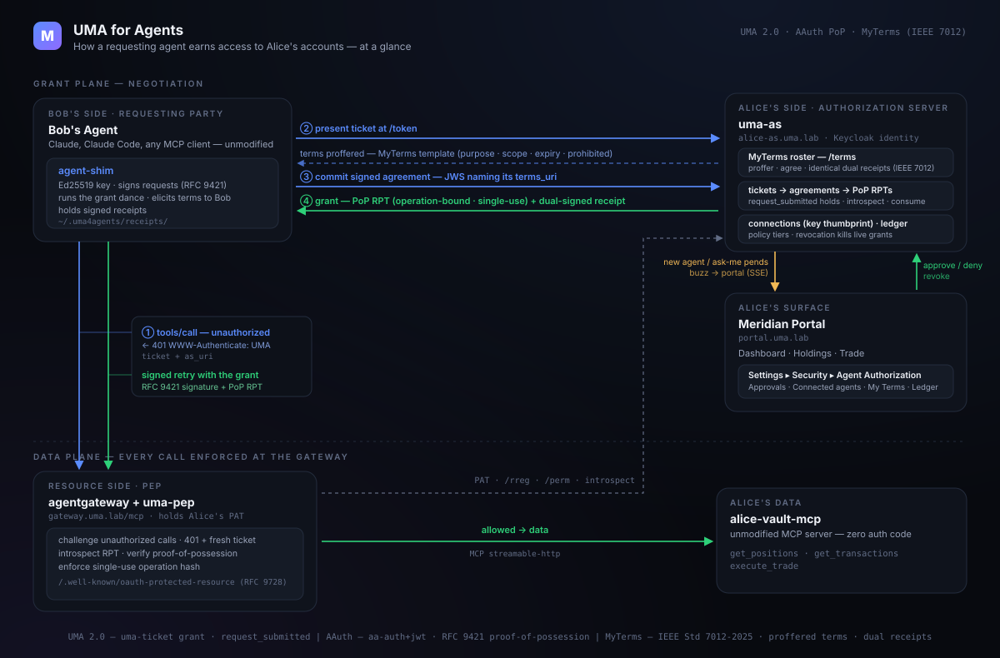

# Architecture

A reference for understanding, operating, or reimplementing the lab. The wire
contract itself — every endpoint, claim, and error — is in
[PROTOCOL.md](PROTOCOL.md); this document is the system view.



## The cast

```
┌─────────────────────────┐        ┌──────────────────────────────────────────┐
│  Bob's agent            │        │  Alice's side                            │
│  (Claude Code, or any   │        │                                          │
│   MCP client)           │        │   keycloak      identity, OIDC login     │
│        │                │ signed │   uma-as        grant loop, policy,      │
│   agent-shim  ──────────┼─ MCP ─▶│                 tickets, RPTs, ledger,   │
│   (keys, RFC 9421,      │        │                 connections              │
│    grant dance)         │        │   alice-portal  brokerage UI + the       │
└───────────┬─────────────┘        │                 agent-authorization panel│
            │                      └──────────────────────────────────────────┘
┌───────────┴─────────────┐                          ▲
│  agent-operator         │   resolved for display   │
│  Bob's firm's public    ├──────────────────────────┘
│  presence: CIMD doc +   │
│  Web Bot Auth directory │
└─────────────────────────┘

                    the resource side — one core, two hosts
                          (lib/uma4a_pep.py)                    ▲
                                                                │ PAT, /perm,
  ENFORCEMENT_MODE=gateway  (default)                           │ introspect,
  ┌────────────────────┐   ext_authz (HTTP)                     │ /consume
  │  agentgateway      │──────────▶ uma-pep ───────────────────▶│
  │  (hosts the PEP)   │            challenge · introspect ·    │
  │         │          │            PoP · scoping · consume     │
  │         ▼          │                                        │
  │  alice-vault-mcp   │  a stock MCP server; no auth code      │
  └────────────────────┘                                        │
                                                                │
  ENFORCEMENT_MODE=embedded  (no gateway in the authz path)      │
  ┌──────────────────────────────────┐                          │
  │  alice-vault-mcp + uma_extension │─────────────────────────▶│
  │  the same core, in-process       │
  │  (Extension.intercept_tool_call) │  same AS, same ticket, same
  └──────────────────────────────────┘  terms; only beat 1 differs

Supporting: person-server (the AAuth agent-identity component, for the
identified-level path; the demo default is pseudonymous keys), Grafana + Loki
+ Promtail (protocol-event observability), Envoy edge (TLS for *.uma.lab),
hickory-dns.
```

The defining split: **Alice reads and trades her own vault directly** through
her portal (she owns it). **Other people's agents** reach the same vault only
after negotiating a grant against her policy. That negotiation — not the
gateway — is the subject of this lab.

**Two shapes, one implementation.** The lab supports a *gateway* shape, with
plain MCP servers behind it that know nothing about UMA, and an *embedded*
shape with no gateway, where the MCP server handles the grant itself.

There are also two *deployment* shapes over the same source: this compose
stack, and a Kubernetes reference architecture where each party is its own
namespace and the seam between them is enforced by a service mesh rather than
described in a document like this one. See [KUBERNETES.md](KUBERNETES.md).

That is allowed because of what FedAuthz does and does not say. It gives the
resource server a job list — hold a PAT ([FedAuthz
§1.5](https://docs.kantarainitiative.org/uma/wg/rec-oauth-uma-federated-authz-2.0.html)),
keep the AS's view of its resources current (§3), ask for a permission ticket
(§4), introspect before allowing a call (§5) — and never names the software
that does the work. §1.4, *Separation of Responsibility and Authority*,
divides responsibility between the resource owner, resource server, and
authorization server: between **parties**, not processes. Nothing there
requires the resource server to be one program.

The word "gateway" was ours, not the spec's, and using it as though it were
structural was our error: earlier drafts of this document and of FINDINGS
described the gateway as *where the burden goes*, which quietly promoted one
deployment into a finding. Both shapes run here against the same authorization
server, the same ticket and the same terms — MCP SDK 2.x exposes
`Extension.intercept_tool_call`, which is the hook the embedded shape uses.

## Services

| Service | Role | Language / base |
|---|---|---|
| `uma-as` | An owner's authorization server: the four-beat grant loop, tiered policy, ticket lifecycle, RPT issuance, connections, ledger, owner API, SSE. One per owner here (`alice-as`, `carol-as`), which is a packaging choice — the store is scoped per owner either way | Python / FastAPI |
| `agent-operator` | Bob's firm's public presence: its CIMD document (who operates the agent) and Web Bot Auth key directory (where its keys are published). Display and discovery only — never an authorization input | Python / FastAPI |
| `uma-pep` | The enforcement core hosted as an ext_authz service (`ENFORCEMENT_MODE=gateway`): challenges, RPT introspection, proof-of-possession verification, tool→resource scoping, single-use operation binding | Python / FastAPI |
| `agentgateway` | The MCP gateway/PEP host; delegates authz to `uma-pep` via HTTP ext_authz | Solo.io agentgateway |
| `alice-vault-mcp` | An owner's brokerage vault as an MCP server (fixture data); one instance per owner, holding her positions rather than a row in anybody else's. Under `ENFORCEMENT_MODE=gateway` the protection obligations sit outside it; under `embedded` it runs the same core in-process via `uma_extension.py` | Python / MCP SDK 2.x |
| `alice-portal` | Meridian Wealth: dashboard, holdings, trade, and Settings → Security → Agent Authorization | Python / FastAPI + vanilla SPA |
| `keycloak` | The identity provider, with a realm per owner and an OIDC login for the portal. Neither owner's: an authority that accepts another party's tokens for its owner is only partly hers | Keycloak |
| `person-server` | AAuth Person/Agent server — the agent-identity component for the identified-level path (the demo default signs pseudonymously) | upstream (pinned) |
| `agent-shim` | The U4A adapter: lets an unmodified MCP client be the requesting agent. Runs as a local stdio subprocess beside Claude Code, or as a network service (`UMA4A_SHIM_TRANSPORT=streamable-http`) when the agent is not a local process. Holds the requesting side's key and runs all four beats, so what sits above it needs no U4A code at all | Python / MCP SDK |
| `kagent` | An agent framework, unmodified, pointed at that adapter — the adoption case rather than a protocol one. Off by default; it brings a model with it (in-cluster Ollama, or a hosted provider). Kubernetes only. See [KAGENT.md](KAGENT.md) | upstream (pinned) |
| `paios` | Kwaai's pAI-OS with the U4A ability installed: Alice's personal AI, holding her key and answering her authorization server. Off by default — an alternative surface to her portal, not a layer under it. See [DEMOS.md](DEMOS.md) | upstream (pinned) + `kwaai/abilities/` |
| observability | Grafana + Loki + Promtail; one structured event per protocol step, ticket = correlation id | Grafana stack |

Shared code in `lib/`: `uma4a_http_sig.py` (RFC 9421 signing/verification, used
by both shim and PEP so signer and verifier can't drift), `uma4a_grant.py`
(the requesting-agent side of the grant loop, used by both the shim and the
headless demo driver), and `uma4a_pep.py` — the enforcement core, expressed in
request *facts* rather than any server's request object, so the ext_authz
service and the in-process extension reach identical verdicts from one
implementation. `make embedded-check` proves that by running the whole grant
with no gateway in the path.

**MCP protocol note.** The lab speaks MCP 2026-07-28. The handshake is
`server/discover`, not `initialize` — the latter cannot negotiate past
2025-11-25 by construction — there are no sessions, and client identity rides
`params._meta` on every request.

## The four-beat grant (agent's view)

1. **Challenge** — agent calls a tool and is refused with the AS location and
   a permission ticket. A host with a status line sends `401` +
   `WWW-Authenticate: UMA`; an in-process one sends a JSON-RPC `-32001`
   carrying the same parameters. The client accepts either.
2. **Attempt** — agent presents the ticket at Alice's AS token endpoint; the
   AS answers `need_info` with the terms template it dictates for that tier.
3. **Commit** — agent signs the intent contract (echoing the dictated terms)
   and re-presents it. For a new agent, or an ask-me tier, the AS returns
   `request_submitted` and holds the ticket until Alice decides in her portal.
   The requesting side does not block through that: after a short window the
   shim hands the wait up to Bob's client as an MCP `input_required` with a
   resumable `request_state`, so the call suspends rather than hanging.
4. **Grant** — the AS issues a proof-of-possession RPT; the agent retries the
   signed call and the gateway lets it through after introspection.

Everything else — registration, the PAT, introspection — is setup the agent
never sees. Discovery leads the flow: the gateway publishes signed RFC 9728
Protected Resource Metadata (`/.well-known/oauth-protected-resource`) naming
the owner's AS and the *structural* tool surfaces, and both clients
corroborate each challenge against it. Which instances belong to whom is not
public: the owner-bound listing (`/owner-resources`) is served only to
Alice's AS, which pulls it to build its registry. Registration here is
declarative only — classic push RReg was built, measured, and is preserved on
the `legacy/rreg-baseline` branch rather than carried forward. See
[PROTOCOL.md](PROTOCOL.md) for the exact messages.

## The day-1 handshake (first contact)

Trust between Alice and a new agent is established the first time that agent
presents her terms:

- An agent with **no standing connection** pends on first contact regardless of
  tier — UMA's `request_submitted` doing double duty as owner-mediated agent
  registration. Alice sees the request in her portal (identity level, the
  agent's key thumbprint, the operation, the prohibitions it signed).
- **Approval** records a connection keyed by the agent's identity handle —
  the RFC 7638 JWK thumbprint for a pseudonymous agent, the verified
  issuer-qualified subject for an identified one. Thereafter, non-ask-me
  tiers auto-grant *for that connection*; ask-me tiers still pend per
  operation.
- **Revocation** (Connected Agents → Revoke) deactivates the connection and any
  live RPTs immediately.

This is how the standing relationship — "my advisor's agent" versus "a stranger
who happened to accept my terms" — is formed and governed.

## Tiers and policy

Alice's policy is a small, legible document (`services/uma-as/policy.py`),
editable from the portal as a form or as JSON in the Monaco editor. Each tier
names the resources it covers, the terms template the AS dictates, and whether
granting requires asking her:

- **Tier 1 — holdings summary**: auto-grant under standard terms.
- **Tier 2 — transaction history**: auto-grant under visibly stricter terms.
- **Tier 3 — trade execution**: `ask_me` — pends for per-operation approval and
  yields a single-use, operation-bound grant.

Each tier may also carry **rules** — policy that faces the requesting agent
without naming one. They read what the authorization server could establish
about the agent (`assurance.*`, in `services/uma-as/assurance.py`) and what
Alice has herself seen of it (`standing.*`), and only the second kind may ever
make a requirement *looser*. Her attention also has a depth limit
(`UMA_AS_PEND_BUDGET`), so a flood of unknown agents is refused rather than
queued, and never crowds out an agent she already knows. See
[ASSURANCE.md](ASSURANCE.md).

## More than one owner

Everything above is written with one owner in it, because one is enough to
explain the grant. The resource server holds more than one, and each of them
names her own authorization server — a second copy of the right-hand column,
with nothing shared between them but the firm in the middle.

That is not an extension of the model; it is the model with the implicit part
made explicit. Every owner-scoped artifact carries its owner, the resource is
addressed per owner at `/mcp/<owner>`, and the RFC 9728 document for each one
names a different authority. [MULTI-OWNER.md](MULTI-OWNER.md) covers it,
including how a resource server comes to hold a protection token from an
authority nobody configured it against.

## Resources that are not hers

The section above adds owners. This one adds a kind of owner: a company that
owns resources and shares them with the people who work on them.

```
┌──────────────────────────────┐        ┌─────────────────────────────────┐
│  Northwind Capital           │        │  Alice's side                   │
│                              │        │                                 │
│   org-authority   charter,   │◀──1───▶│   uma-as    clamps her tiers to │
│                   members,   │        │             the ceiling; asks   │
│                   roles,     │        │             the organization    │
│                   break-glass│        │             about each request  │
│   opa             the engine │        │                                 │
│   org-console     the admin  │        └─────────────────────────────────┘
└───────────┬──────────────────┘                        │
            │ 2                                         │ governs
            ▼                                           ▼
     ┌──────────────────────────────────────────────────────────┐
     │  Meridian — one resource server                          │
     │    alice-vault/*       hers          → alice's authority │
     │    carol-vault/*       hers          → carol's authority │
     │    northwind-vault/*   Northwind's   → whichever member  │
     │                        shared with     is named in the   │
     │                        Alice, Carol    path              │
     └──────────────────────────────────────────────────────────┘
              /mcp   /mcp/carol   /mcp/shared/alice   /mcp/shared/carol
```

1. The envelope goes out and a decision comes back. The charter's conditions
   and the administrator's Rego stay on the organization's side; her tiers
   stay on hers. Neither reads the other's.
2. The organization *owns* `northwind-vault/*`. It does not enforce anything:
   the enforcement point asks whichever member's authority the path names, and
   independently checks that the ceiling was applied.

The four beats are unchanged on a shared resource. An agent negotiating for
the firm's book runs the same challenge, the same terms, the same agreement
and the same grant it runs for Alice's own account, with a different
authority named in the challenge — which is the same thing that already
differed between Alice and Carol. [ORG.md](ORG.md) covers what is new: the
ceiling, the roles, whose agent may act, and where the organization's reach
stops.

## Ports and hostnames

TLS everywhere via the Envoy edge and a local CA (`make init`). Browser access
uses the hostnames; the smoke tests and demo driver pin DNS and the CA
explicitly so they work without host configuration.

| Hostname | Service |
|---|---|
| `portal.uma.lab` | Alice's portal |
| `gateway.uma.lab` | agentgateway (agents connect here: `/mcp/<owner>`) |
| `alice-as.uma.lab` | Alice's uma-as (token, introspection, owner API) |
| `carol-as.uma.lab` | Carol's — a second owner of the same resource server, on an authority the firm was never configured against. See [MULTI-OWNER.md](MULTI-OWNER.md) |
| `keycloak.uma.lab` | Keycloak (a realm per owner) |
| `grafana.uma.lab` | Grafana |
| `ps.uma.lab` | person-server |
| `agent.uma.lab` | agent-operator (Bob's firm's CIMD + key directory) |

## Reimplementing this

The grant semantics live entirely in `uma-as` and `uma-pep` and are
transport-agnostic in shape: `uma-as` depends on Keycloak only for Alice's
identity and signs its own tokens; `uma-pep` is a generic ext_authz service any
Envoy-family gateway can call. To port the pattern, keep the four-beat contract
and the connection model from [PROTOCOL.md](PROTOCOL.md) and swap the identity
provider, gateway, or resource layer as needed.
